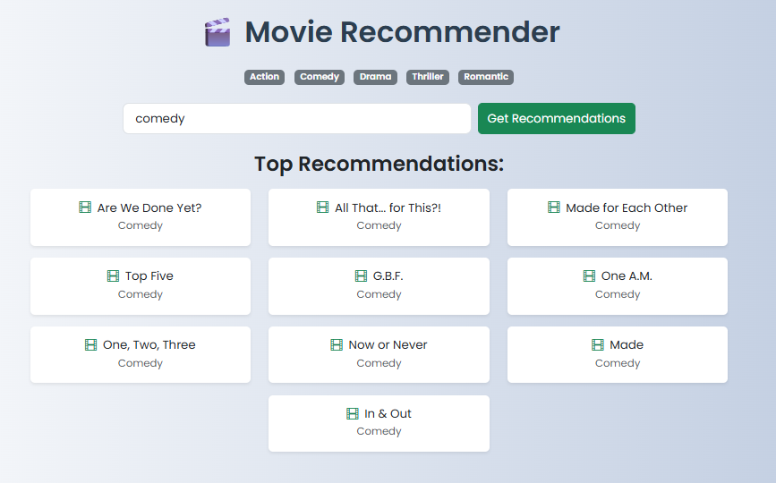

🎬 Movie Recommender System

A smart and intuitive Movie Recommender Web Application that suggests movies based on the user's favorite genre  using Machine Learning and Flask.

This system uses TF-IDF and K-Nearest Neighbors (KNN) with cosine similarity to recommend movies by analyzing the movie's title and genre. With a clean UI and real-time results, this project demonstrates how machine learning can be integrated into a web app.

👩‍💻 Project Contributors

@https://github.com/shipali-k-account 
@https://github.com/Smuktha

>We collaborated on building this as part of our mini project using Python and Flask._

🌟 Features

    🔍 Genre-based movie recommendations
    📊 Content-based filtering using title + genres
    ⚙️ TF-IDF + KNN with cosine similarity
    🌐 Flask-based web interface
    💅 Bootstrap styling and custom CSS
    📥 Clean UI and instant results

🧠 How It Works

    1. User types a genre or keyword (e.g., romantic, `action`)
    2. Flask captures the input and sends it to the model
    3. The model uses TF-IDF to convert movie text into numbers
    4.KNN finds the 10 most similar movies using cosine similarity
    5. Recommended movies are shown on the web page

🛠️ Tech Stack

    🔤 Frontend: HTML5, CSS3, Bootstrap 5  
    🧠 Backend: Python 3, Flask Web Framework  
    🧪 Machine Learning: TF-IDF Vectorizer, K-Nearest Neighbors (cosine similarity)  
    🗃️ Dataset: movie.csv 

🖼️ Screenshots

🎯 Homepage

Recommendations Output

> Add your screenshots inside a screenshots/folder in your project and name them homepage.png\,recommendations.png, etc.

📊 Dataset Source

This project uses the [MovieLens dataset](https://grouplens.org/datasets/movielens/) from [GroupLens Research].  
It contains 27,000+ movies with titles and genre information.

📁 Folder Structure

movie_recommender_project2/
│
├── app.py                 # Flask backend
├── recommender.py         # Machine learning recommendation logic
├── data_cleaning.py       # Script for cleaning and preparing movie dataset
│
├── data/
│   ├── movie.csv          # Original movie dataset
│   └── clean_movie.csv    # Preprocessed movie data
│
├── static/
│   └── style.css          # Custom CSS styles
│
├── templates/
│   └── index.html         # Frontend HTML page
│
├── screenshots/
│   ├── homepage.png       # Homepage screenshot
│   └── recommendations.png# Recommendation result screenshot
│
└── README.md              # Project documentation

🚀 How to Run This Project

📌 Requirements
    Python 3.x
    pip installed

📥 Install Dependencies

    pip install flask pandas scikit-learn
 
⚙️ Run the project:

 python app.py
 Now visit: http://127.0.0.1:5000

📜 License
This project is for educational/demo purposes only.
All movie data is used for learning and demonstration.